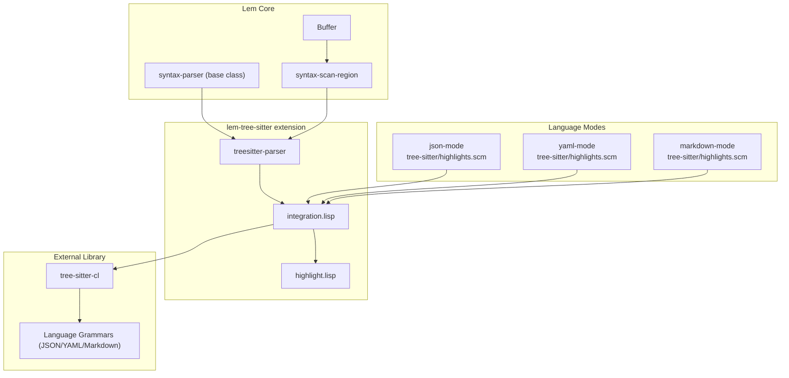

# Tree-sitter Syntax Highlighting Architecture

このドキュメントはfeature/tree-sitter-syntax-highlightingブランチで導入されるtree-sitter統合機能のアーキテクチャを記述する。

## 1. Overview

### 目的
- Lemエディタにtree-sitterベースの構文ハイライトを導入
- 既存のTextMateスタイルの正規表現パーサーを補完
- より正確で高速な構文解析を提供

### ユースケース
- JSON/YAML/Markdownファイルの構文ハイライト
- インクリメンタルパース（編集時の差分更新）
- 将来の言語サポート拡張の基盤

### 非目標
- 全言語モードの即時置換（オプトイン方式）
- tree-sitterが利用不可な環境での必須化（tmlanguageフォールバック維持）

## 2. System Architecture



## 3. Execution Flow

### 3.1 構文スキャンシーケンス


### 3.2 インクリメンタルパースフロー


## 4. Modules & Dependencies

### 4.1 レイヤー構成

| Layer | Package | Role |
|-------|---------|------|
| External | `tree-sitter-cl` | tree-sitterのCommon Lispバインディング |
| Extension | `lem-tree-sitter` | Lem統合レイヤー（基盤のみ） |
| Extension | `lem-tree-sitter/highlight` | キャプチャ→属性マッピング |
| Mode | `lem-json-mode`, `lem-yaml-mode`, `lem-markdown-mode` | 言語固有のクエリとtmlanguageフォールバック |

### 4.2 主要コンポーネント

#### treesitter-parser class
- `extensions/tree-sitter/integration.lisp:5-25`
- `lem/buffer/internal::syntax-parser`を継承
- スロット: `language-name`, `parser`, `tree`, `highlight-query`, `source-cache`, `pending-edits`

#### enable-tree-sitter-for-mode
- `extensions/tree-sitter/integration.lisp:142-160`
- 既存モードのsyntax-tableにtree-sitterパーサーを設定
- **シグネチャ**: `(syntax-table language query-path)`
- grammar/queryが存在しない場合は静かにフォールバック

#### capture-to-attribute
- `extensions/tree-sitter/highlight.lisp:12-20`
- tree-sitterのキャプチャ名をLemの属性に変換
- 階層的ルックアップ対応（`keyword.control` → `keyword`）

### 4.3 依存関係

```
lem-tree-sitter
├── lem/core
├── tree-sitter-cl
└── alexandria

lem-json-mode
├── lem/core
├── lem-js-mode
└── lem-tree-sitter
    └── tree-sitter/highlights.scm (owns query)

lem-yaml-mode
├── lem/core
└── lem-tree-sitter
    └── tree-sitter/highlights.scm (owns query)

lem-markdown-mode
├── (existing deps)
└── lem-tree-sitter
    └── tree-sitter/highlights.scm (owns query)
```

## 5. Data Model

### 5.1 Query Files (highlights.scm)

各言語モードが自身のクエリファイルを所有:

| Language | Path | Captures |
|----------|------|----------|
| JSON | `extensions/json-mode/tree-sitter/highlights.scm` | string, number, boolean, property, punctuation |
| YAML | `extensions/yaml-mode/tree-sitter/highlights.scm` | scalar types, comment, anchor, tag, property |
| Markdown | `extensions/markdown-mode/tree-sitter/highlights.scm` | headers (h1-h6), code blocks, quotes, lists |

### 5.2 Capture → Attribute Mapping

| Capture Category | Lem Attribute |
|-----------------|---------------|
| `keyword*` | `syntax-keyword-attribute` |
| `string*` | `syntax-string-attribute` |
| `comment*` | `syntax-comment-attribute` |
| `number*` | `syntax-constant-attribute` |
| `function*` | `syntax-function-name-attribute` |
| `type*` | `syntax-type-attribute` |
| `markup.heading.N` | `document-headerN-attribute` |

Reference: `extensions/tree-sitter/highlight.lisp:26-143`

## 6. Configuration

### 6.1 有効化メカニズム

各言語モードの`define-major-mode`本体で呼び出し:

```lisp
;; extensions/json-mode/json-mode.lisp
(defun tree-sitter-query-path ()
  (asdf:system-relative-pathname :lem-json-mode "tree-sitter/highlights.scm"))

(define-major-mode json-mode language-mode (...)
  (lem-tree-sitter:enable-tree-sitter-for-mode
   *json-syntax-table* "json" (tree-sitter-query-path))
  ...)
```

### 6.2 フォールバック動作

1. モード初期化時にtmlanguageがsyntax-parserとして設定
2. `enable-tree-sitter-for-mode`が呼ばれる
3. tree-sitter利用可能ならパーサーを上書き
4. 利用不可なら何もせず、tmlanguageがそのまま使用される

## 7. Build & Release

### 7.1 依存ライブラリ

- `qlfile:13`: `git tree-sitter-cl https://github.com/lem-project/tree-sitter-cl.git`
- `lem.asd`: `lem-tree-sitter`を全ビルドで含める（条件なし）
- Nixビルド: `flake.nix`で言語grammarを含める

### 7.2 テスト

- テストファイル: `extensions/tree-sitter/tests/main.lisp`
- テストシステム: `lem-tree-sitter/tests`
- テスト内容:
  - `test-tree-sitter-availability`: ライブラリ検出
  - `test-capture-mapping`: 属性マッピング
  - `test-parser-creation`: パーサー生成
  - `test-highlight-position-accuracy`: バイト位置の正確性
  - `test-multiline-highlight-positions`: 複数行対応
  - `test-yaml-buffer-attributes`: 実際の構文ハイライト適用

## 8. Risks & Improvements

### 8.1 リスク

1. **内部シンボル依存** (`lem/buffer/internal::syntax-parser`, `lem/buffer/internal::%syntax-scan-region`)
   - `extensions/tree-sitter/integration.lisp:5,40`
   - 将来のリファクタリングで破損する可能性

2. **インクリメンタルパースの近似**
   - `extensions/tree-sitter/integration.lisp:190-216`
   - `old-len`がバイト数ではなく文字数のため正確な`old-end-point`計算ができない

### 8.2 解決済みの課題

1. ~~**Byte offset計算の複雑さ**~~
   - `(1+ byte-offset)`パターンで解決（lisp-mode, language-serverと同じ）

2. ~~**Nix限定の統合**~~
   - `#+nix-build`条件を削除、全ビルドで利用可能に

3. ~~**責務の分離**~~
   - クエリファイルを各言語モードに移動

### 8.3 改善案

1. **公開APIの追加**: `syntax-parser`基底クラスと`%syntax-scan-region`をpublicにエクスポート
2. **バイト単位の編集追跡**: `after-change-functions`フックでバイトオフセットを提供
3. **追加言語対応**: Python, JavaScript, Common Lispのquery追加

## 9. Open Questions

1. tree-sitter-clの`tree-edit`は古いtreeをin-placeで変更するか、新しいtreeを返すか？
   - 現在の実装は前者を仮定: `integration.lisp:67`

2. Markdownのinline要素（bold, italic）がブロックgrammarのみで処理されるのは意図的か？
   - `markdown-mode/tree-sitter/highlights.scm`にはinline要素のクエリがない

## 10. References

### コードエビデンス

| Description | Location |
|-------------|----------|
| treesitter-parser class definition | `extensions/tree-sitter/integration.lisp:5-25` |
| %syntax-scan-region implementation | `extensions/tree-sitter/integration.lisp:40-50` |
| enable-tree-sitter-for-mode | `extensions/tree-sitter/integration.lisp:142-160` |
| Capture mapping definitions | `extensions/tree-sitter/highlight.lisp:26-143` |
| Incremental edit recording | `extensions/tree-sitter/integration.lisp:190-216` |
| JSON mode integration | `extensions/json-mode/json-mode.lisp:52-63` |
| YAML mode integration | `extensions/yaml-mode/yaml-mode.lisp:43-53` |
| Markdown mode integration | `extensions/markdown-mode/markdown-mode.lisp:16-26` |
| Base syntax-parser class | `src/buffer/internal/syntax-parser.lisp:16-17` |
| %syntax-scan-region generic | `src/buffer/internal/syntax-parser.lisp:19` |
| qlfile tree-sitter-cl entry | `qlfile:13` |
| lem-tree-sitter in lem.asd | `lem.asd:305` |

### 変更されたファイル一覧

| File | Change Type |
|------|-------------|
| `extensions/tree-sitter/{integration,highlight,package}.lisp` | NEW |
| `extensions/json-mode/json-mode.lisp` | MODIFIED |
| `extensions/json-mode/tree-sitter/highlights.scm` | NEW |
| `extensions/yaml-mode/yaml-mode.lisp` | MODIFIED |
| `extensions/yaml-mode/tree-sitter/highlights.scm` | NEW |
| `extensions/markdown-mode/markdown-mode.lisp` | MODIFIED |
| `extensions/markdown-mode/tree-sitter/highlights.scm` | NEW |
| `extensions/*/lem-*-mode.asd` | MODIFIED (dependency) |
| `lem.asd` | MODIFIED |
| `qlfile` | MODIFIED |
| `flake.nix` | MODIFIED |
