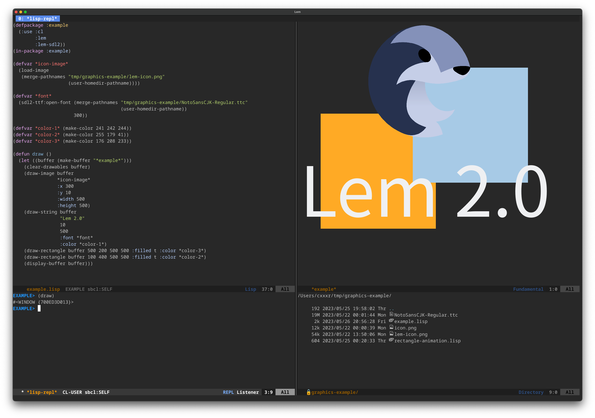
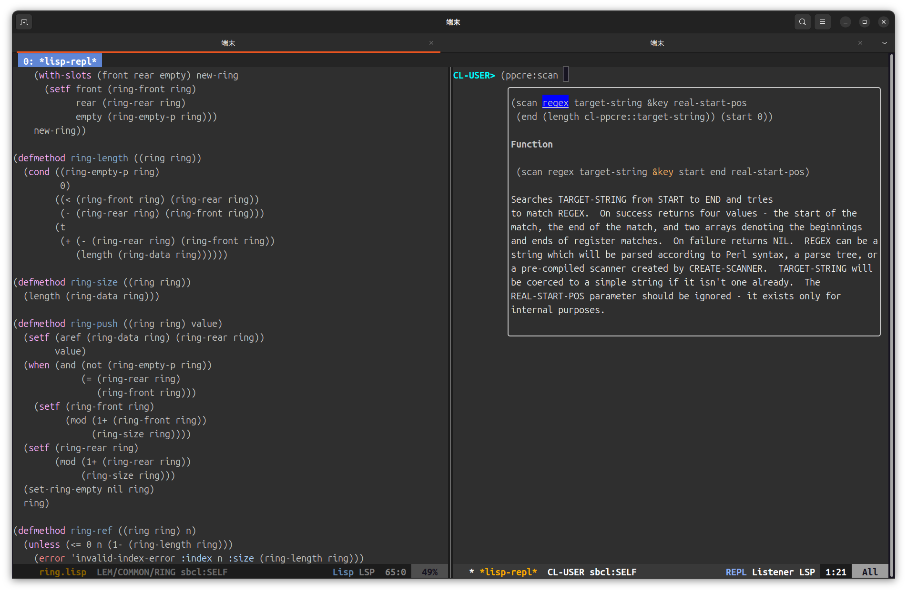

# Lem is the editor/IDE well-tuned for Common Lisp.


[](#backers) [](#sponsors)

After installing lem, you can start developing in Common Lisp at once.

You can skip over writing tidy settings or installing many plugins as you do on Emacs.

Lem supports other programming languages thanks to its built-in LSP
client. You can choose between an Emacs and a Vim mode.

Other Lem features include:

- a **project explorer** tree view
- project-aware commands
- interactive **grep** and **git** interfaces
- **multiple cursors**
- tetris
- and more…

# Download

**Lem 2.1 was released!**

See our [Lem 2.1 realease](https://github.com/lem-project/lem/releases/tag/v2.1.0) to
download binaries for Windows, MacOS and Linux.

On mac, you need to run `xattr -d com.apple.quarantine /Applications/lem.app`.  
See https://github.com/lem-project/lem/issues/635



# If the installation fails
Please refer to the following issue
https://github.com/lem-project/lem/issues/628

## Screenshot
　　

## Requirement
- ncurses
- sbcl
- qlot
- SDL2 (optional)

## Platform
- Linux
- MacOS
- [Windows](https://github.com/lem-project/lem/wiki/Windows-Platform)

## Install

### Requirement

#### sbcl
#### qlot

See https://github.com/fukamachi/qlot#installation

```
curl -L https://qlot.tech/installer | bash
```

## build

```
make
```
### SDL2
Dependent packages must be installed.  
See https://github.com/lem-project/lem/blob/main/frontends/sdl2/README.md

```
make sdl2
```

## update
```
make update
```

## Usage

```
$ lem <filename.lisp>
```

You can watch the screencast on Youtube.

[Screencast](https://youtu.be/YkSJ3p7Z9H0)


You can start "lem" using the following command.
```
$ qlot exec sbcl
* (ql:quickload :lem-ncurses)
* (lem:lem)
```

## Configuration

Lem loads `~/.lem/init.lisp` when starting up.

You can see an example [here](https://github.com/Fedreg/.lem/blob/master/init.lisp)

fukamachi also published his init files on GitHub.
https://github.com/fukamachi/.lem

## Extensions and modes

* [Pareto](https://github.com/40ants/lem-pareto) - A mode, complement to the Paredit. Makes Lisp code editing even more efficient!

## How to develop lisp
See https://lem-project.github.io/lem-page/usage/common_lisp/

## How to hack on lem itself
See https://github.com/lem-project/lem/wiki/How-to-hack-on-lem-itself

If you have a questions, join [the Discord](https://discord.gg/NHzqbw4zVR).

## How to contribute to lem
See https://lem-project.github.io/lem-page/development/how-to-contribute-to-lem/

## Contributors

This project exists thanks to all the people who contribute. [[Contribute]](CONTRIBUTING.md).

<a href="https://github.com/lem-project/lem/graphs/contributors">
  
</a>

## Backers

Thank you to all our backers! 🙏 [[Become a backer](https://opencollective.com/lem#backer)]

<a href="https://opencollective.com/lem#backers" target="_blank"></a>


## Sponsors

Support this project by becoming a sponsor. Your logo will show up here with a link to your website. [[Become a sponsor](https://opencollective.com/lem#sponsor)]

<a href="https://opencollective.com/lem/sponsor/0/website" target="_blank"></a>
<a href="https://opencollective.com/lem/sponsor/1/website" target="_blank"></a>
<a href="https://opencollective.com/lem/sponsor/2/website" target="_blank"></a>
<a href="https://opencollective.com/lem/sponsor/3/website" target="_blank"></a>
<a href="https://opencollective.com/lem/sponsor/4/website" target="_blank"></a>
<a href="https://opencollective.com/lem/sponsor/5/website" target="_blank"></a>
<a href="https://opencollective.com/lem/sponsor/6/website" target="_blank"></a>
<a href="https://opencollective.com/lem/sponsor/7/website" target="_blank"></a>
<a href="https://opencollective.com/lem/sponsor/8/website" target="_blank"></a>
<a href="https://opencollective.com/lem/sponsor/9/website" target="_blank"></a>


# License
[MIT](https://github.com/lem-project/lem/blob/master/LICENCE)
