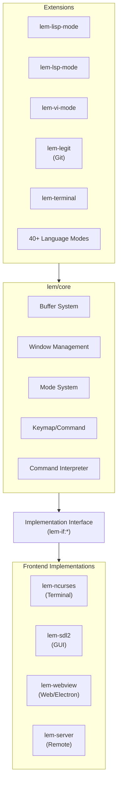

# Lem Architecture Document

## 1. Overview

### Purpose
Lem (Editor Modules) is a Common Lisp-based text editor that aims to minimize the distance between code and its execution state, allowing users to see program results while editing without breaking their flow.

### Use Cases
- Interactive Common Lisp development with live code evaluation
- General-purpose text editing with syntax highlighting
- Language Server Protocol (LSP) integration for multiple languages
- Vi-mode emulation for Vim users
- Git integration via legit extension

### Non-Goals
- Emacs/Vim imitation - Lem pursues its own unique approach
- `lem.asd:57`

## 2. System Architecture



### Key Architectural Decisions
- **Pluggable Frontend Architecture**: Core editor logic is decoupled from display via `implementation` interface
  - `src/interface.lisp:5-43`
- **ASDF System Composition**: Uses ASDF defsystem for modular package management
  - `lem.asd:17-232`
- **Event-Driven Command Loop**: All user interactions processed through centralized command loop
  - `src/interp.lisp:125-137`

## 3. Execution Flow

### Startup Sequence

```mermaid
sequenceDiagram
    participant User
    participant Main as main()
    participant Launch as launch()
    participant Frontend as invoke-frontend()
    participant Editor as run-editor-thread()
    participant Loop as command-loop()

    User->>Main: lem args
    Main->>Launch: parse-args
    Launch->>Launch: Select implementation<br/>(ncurses/sdl2)
    Launch->>Frontend: invoke-frontend
    Frontend->>Editor: create editor thread
    Editor->>Editor: setup()
    Editor->>Editor: load-init-file()
    Editor->>Loop: toplevel-command-loop
    Loop->>Loop: redraw-display
    Loop->>Loop: read-command
    Loop->>Loop: call-command
    Loop-->>Loop: repeat
```

### Command Execution Flow
1. User presses key
2. `read-command` translates key to command via keymap lookup
   - `src/keymap.lisp:210-214`
3. `call-command` executes the command
   - `src/interp.lisp:71-113`
4. `redraw-display` updates the screen
   - `src/interp.lisp:72-76`

## 4. Modules & Dependencies

### Layer Architecture

| Layer | Components | Responsibility |
|-------|------------|----------------|
| Frontend | ncurses, sdl2, webview, server | Input handling, rendering |
| Core | buffer, window, mode, keymap, interp | Editor logic |
| Extensions | language modes, LSP, vi-mode | User features |
| Common | ring, timer, hooks, utils | Shared utilities |

### Core System (lem/core)

**External Dependencies**:
- `alexandria`, `cl-ppcre`, `bordeaux-threads`, `log4cl`, `yason`
- `src/lem.asd:18-43`

**Internal Module Structure**:
```
src/
├── common/          # Shared utilities (ring, timer, hooks)
├── buffer/          # Buffer, point, undo system
│   └── internal/    # Core buffer operations
├── window/          # Window tree, splitting, scrolling
├── commands/        # Built-in commands (move, edit, file)
├── display/         # Rendering logic
├── ext/             # Core extensions (completion, isearch, grep)
└── ui/              # Theme management
```

### Frontend Systems

| Frontend | File | Dependencies |
|----------|------|--------------|
| ncurses | `frontends/ncurses/` | cl-charms, cffi |
| SDL2 | `frontends/sdl2/` | sdl2, sdl2-ttf, sdl2-image |
| webview | `frontends/webview/` | webview, lem-server |
| server | `frontends/server/` | JSON-RPC, websocket |

### Extension Dependencies

```
lem/extensions
├── lem-lisp-mode      (requires: micros, swank)
├── lem-lsp-mode       (requires: jsonrpc, lem-language-client)
├── lem-vi-mode        (requires: esrap, closer-mop)
└── lem-legit          (requires: legit)
```

## 5. Data Model

### Buffer Structure
- `src/buffer/internal/buffer.lisp:5-94`

```
buffer
├── name: string
├── filename: pathname (optional)
├── point: point (current cursor)
├── start-point / end-point: point
├── mark: mark
├── major-mode: symbol
├── minor-modes: list
├── syntax-table: syntax-table
├── variables: hash-table (buffer-local vars)
├── edit-history: array (undo stack)
└── nlines: integer
```

### Window Structure
- `src/window/window.lisp:31-127`

```
window
├── x, y, width, height: fixnum
├── buffer: buffer
├── view-point: point (top of visible area)
├── point: point (cursor in window)
├── view: frontend-specific view object
└── parameters: plist
```

### Mode Hierarchy
- `src/mode.lisp:27-46`

```
mode (base class)
├── major-mode
│   └── syntax-table, hook-variable
├── minor-mode
│   └── enable-hook, disable-hook
├── global-minor-mode
└── global-mode
```

## 6. External Integrations

### Language Server Protocol (LSP)
- `extensions/lsp-mode/lem-lsp-mode.asd`
- Uses `jsonrpc` for communication
- Supports stdio and TCP transports
- Integrates with `lem-language-client`

### Git Integration
- `extensions/legit/` - Full git porcelain interface
- Commit, diff, log, branch operations

### External Process Management
- `extensions/process/` - Async subprocess handling
- `extensions/terminal/` - Terminal emulator

## 7. Configuration

### Environment Variables

| Variable | Purpose | Reference |
|----------|---------|-----------|
| `LEM_HOME` | Override config directory | `src/config.lisp:3-8` |

### Configuration Paths
- `$XDG_CONFIG_HOME/lem/` or `~/.lem/`
- `init.lisp` - User initialization
- `build-init.lisp` - Build-time initialization
- `config.lisp` - Persistent settings (plist format)

### Init File Loading
1. `$LEM_HOME/init.lisp`
2. `~/.lemrc`
3. `./.lemrc` (current directory, if different from home)
- `src/lem.lisp:36-48`

## 8. Observability

### Logging
- Uses `log4cl` for logging
- Default log file: `$LEM_HOME/debug.log`
- Configurable via `--log-filename` and `--debug` flags
- `src/lem.lisp:115-124`

### Error Handling
- `*editor-abort-hook*` - Called on C-g abort
- Backtraces displayed in `*EDITOR ERROR*` buffer
- `src/interp.lisp:14-25`

## 9. Build & Release

### Build Systems

**ASDF Systems**:
- `lem/core` - Core editor
- `lem/extensions` - All bundled extensions
- `lem` - Full distribution with default frontend

**Build Commands**:
```bash
# Terminal version
make ncurses

# SDL2 GUI version
make sdl2

# AppImage (Linux)
make AppImage
```

### CI/CD Pipeline

| Workflow | Trigger | Purpose |
|----------|---------|---------|
| `test.yml` | Push/PR | Run tests, lint, push Docker image |
| `nightly-builds.yml` | Daily/Manual | Build Linux AppImage & macOS bundle |
| `generate-document.yml` | - | Documentation generation |

- `.github/workflows/test.yml`
- `.github/workflows/nightly-builds.yml`

### Test Framework
- Uses `rove` test framework
- Tests in `tests/` and extension-specific test directories
- Run: `.qlot/bin/rove lem-tests.asd`

## 10. Risks & Improvements

### Risks
1. **SBCL Dependency**: Several features require SBCL (profiler, lisp-mode full functionality)
   - `lem.asd:235-240`, `#+sbcl` conditionals throughout
2. **Frontend Fragmentation**: Multiple frontend implementations may drift in feature parity
3. **Large Startup Overhead**: Loading all extensions increases startup time
4. **Limited Documentation**: Internal APIs lack comprehensive documentation

### Improvement Opportunities
1. **Lazy Extension Loading**: Load extensions on-demand to improve startup time
2. **Type Annotations**: Add more type declarations for performance and documentation
3. **Test Coverage**: Expand E2E and integration tests beyond vi-mode
4. **Frontend Abstraction**: Strengthen interface contract between core and frontends

## 11. Open Questions

1. **Undo Coalescing**: How are consecutive edit operations grouped for undo?
2. **Thread Safety**: What guarantees exist for concurrent buffer access?
3. **Extension API Stability**: Is there a versioned public API for extensions?
4. **Memory Management**: How are large buffers handled (e.g., streaming)?

## 12. References

| Topic | Location |
|-------|----------|
| Entry point | `src/lem.lisp:148-149` |
| Command loop | `src/interp.lisp:125-137` |
| Frontend interface | `src/interface.lisp:62-150` |
| Buffer class | `src/buffer/internal/buffer.lisp:5-94` |
| Window class | `src/window/window.lisp:31-127` |
| Mode system | `src/mode.lisp:138-172` |
| Keymap | `src/keymap.lisp:37-55` |
| Configuration | `src/config.lisp:1-41` |
| ASDF system | `lem.asd:17-305` |
| CI workflows | `.github/workflows/test.yml`, `.github/workflows/nightly-builds.yml` |
