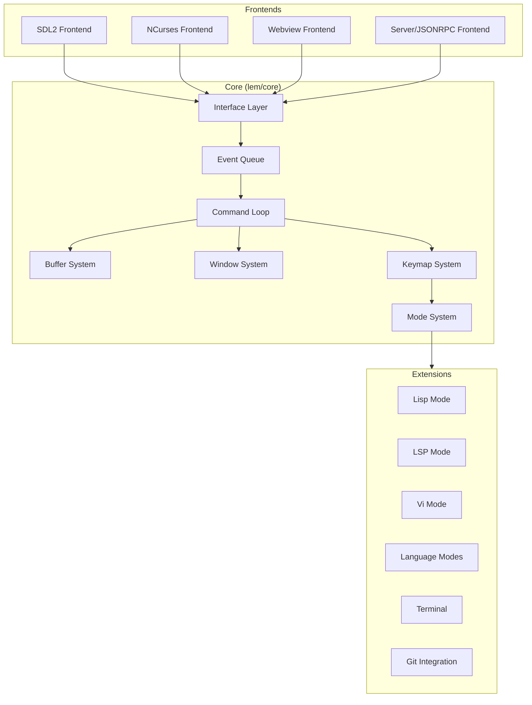
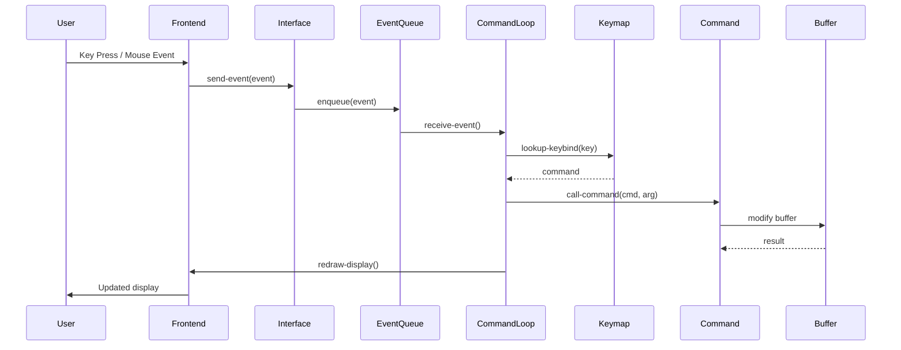

# Lem Editor Architecture

## 1. Overview

### Purpose
Lem is a text editor written in Common Lisp, designed to bring the distance between code and its execution state as close to zero as possible. Users can see the results of their program while editing, and visually follow the behavior of running code in real time.

### Key Use Cases
- Interactive Lisp development with REPL integration
- General-purpose text editing with syntax highlighting
- LSP (Language Server Protocol) support for multiple languages
- Vi-mode emulation for Vim users

### Non-Goals
- Rather than imitating Emacs or Vim, Lem pursues its own unique approach

## 2. System Architecture



## 3. Execution Flow



### Startup Sequence

1. Entry point: `lem:main` or `lem:lem` (`src/lem.lisp:148-149`)
2. Parse command-line arguments
3. Select implementation (frontend) based on args or environment (`src/lem.lisp:131-137`)
4. Call `invoke-frontend` with selected implementation (`src/lem.lisp:140-143`)
5. Frontend creates display and starts event loop
6. `run-editor-thread` spawns editor thread (`src/lem.lisp:75-89`)
7. `setup` initializes first frame and syntax scanner (`src/lem.lisp:22-31`)
8. `toplevel-command-loop` begins processing commands (`src/interp.lisp:139-147`)
9. `init` loads user configuration from `~/.lem/init.lisp` or `~/.lemrc` (`src/lem.lisp:68-73`)

## 4. Modules & Dependencies

### Layer Structure

| Layer | Description | Location |
|-------|-------------|----------|
| Core | Editor kernel, buffer/window/keymap management | `src/` |
| Frontends | Platform-specific display implementations | `frontends/` |
| Extensions | Language modes, LSP, Vi-mode, etc. | `extensions/` |
| Contrib | Community-contributed modules | `contrib/` |

### Core Modules

| Module | Purpose | Key Files |
|--------|---------|-----------|
| `lem/core` | Main editor system | `src/lem.lisp`, `src/interp.lisp` |
| `buffer` | Text buffer management | `src/buffer/internal/buffer.lisp` |
| `window` | Window tree and display | `src/window/` |
| `keymap` | Key binding system | `src/keymap.lisp` |
| `mode` | Major/minor mode system | `src/mode.lisp` |
| `command` | Command definition and execution | `src/defcommand.lisp`, `src/command.lisp` |
| `interface` | Frontend abstraction layer | `src/interface.lisp` |
| `event-queue` | Async event handling | `src/event-queue.lisp` |

### External Dependencies (from lem.asd:18-43)

- `bordeaux-threads` - Threading primitives
- `cl-ppcre` - Regex support
- `alexandria` - Common Lisp utilities
- `trivia` - Pattern matching
- `yason` - JSON parsing
- `log4cl` - Logging
- `dexador` - HTTP client
- `micros` - SLIME/Swank integration

### Frontend Implementations

| Frontend | Package | Transport |
|----------|---------|-----------|
| SDL2 | `lem-sdl2` | Native graphics |
| NCurses | `lem-ncurses` | Terminal |
| Webview | `lem-webview` | WebKit/Chromium |
| Server | `lem-server` | JSON-RPC over WebSocket |

## 5. Data Model

### Buffer

```
Buffer
├── name: string
├── filename: pathname (optional)
├── directory: pathname
├── point: Point (cursor position)
├── start-point / end-point: Point
├── mark: Mark
├── major-mode: symbol
├── minor-modes: list of symbols
├── syntax-table: SyntaxTable
├── variables: hash-table (buffer-local variables)
├── modified-p: boolean
├── read-only-p: boolean
├── encoding: encoding specification
└── edit-history / redo-stack: undo/redo support
```
- Reference: `src/buffer/internal/buffer.lisp:5-94`

### Point

A point represents a position in a buffer (line + character offset).

### Window

Windows display buffers and are organized in a tree structure for splitting.

### Keymap

Hash-table based key binding storage with hierarchical lookup through mode keymaps.
- Reference: `src/keymap.lisp:14-19`

## 6. External Integrations

### LSP (Language Server Protocol)
- Package: `lem-lsp-mode`
- Transport: TCP or stdio
- Reference: `extensions/lsp-mode/lsp-mode.lisp`
- Supports: completion, hover, definition, references, formatting, rename, etc.

### SLIME/Swank (Lisp Development)
- Package: `lem-lisp-mode`
- Provides REPL, debugger, inspector for Common Lisp

### Git (Legit)
- Package: `lem-legit`
- Git status, commit, diff integration

## 7. Configuration

### Environment Variables

| Variable | Purpose |
|----------|---------|
| `LEM_HOME` | Override default config directory |

### Config Locations (src/config.lisp:3-8)
- Primary: `$LEM_HOME` or `~/.config/lem/` (XDG) or `~/.lem/`
- User init: `init.lisp` in config directory
- Alternative: `~/.lemrc`
- Build-time init: `build-init.lisp`

### Config File Format
- Plist-based configuration stored in `config.lisp`
- Reference: `src/config.lisp:19-27`

## 8. Build & Release

### Build System
- ASDF (Another System Definition Facility)
- Qlot for dependency management

### CI/CD Pipeline (.github/workflows/test.yml)
1. Install system dependencies (gtk, webkit)
2. Install Roswell (Common Lisp installer)
3. Install dependencies via Qlot
4. Run linting (check for internal symbol usage)
5. Run tests via Rove
6. Build and push Docker image (on main branch)

### Test Framework
- Rove test runner
- Test files: `lem-tests.asd`, `extensions/vi-mode/lem-vi-mode.asd`

### Build Targets
- Terminal (ncurses)
- SDL2 (graphical)
- Webview (embedded browser)

## 9. Observability

### Logging
- Framework: log4cl
- Default log file: `~/.lem/debug.log` (`src/lem.lisp:124`)
- Configurable via `--log` command-line argument

## 10. Risks & Improvements

### Identified Risks

1. **Thread Safety**: Event queue and buffer modifications may have race conditions in complex scenarios
   - Evidence: `src/event-queue.lisp:3` uses `make-concurrent-queue`

2. **Memory Management**: Large file editing may accumulate undo history
   - Evidence: `src/buffer/internal/buffer.lisp:81-82` uses adjustable arrays for edit history

3. **Frontend Coupling**: Interface abstraction requires all frontends to implement many methods
   - Evidence: `src/interface.lisp:62-145` defines ~40+ generic functions

4. **LSP Error Handling**: Network failures with language servers may not be gracefully handled
   - Evidence: `extensions/lsp-mode/lsp-mode.lisp:95-99` has basic error handling

### Improvement Suggestions

1. **Documentation**: Add inline documentation for public APIs and complex algorithms

2. **Test Coverage**: Expand automated tests beyond vi-mode

3. **Plugin System**: Formalize extension API with versioning

4. **Performance**: Profile and optimize syntax highlighting for large files

## 11. Open Questions

1. How is buffer garbage collection handled when buffers are deleted?
2. What is the threading model for LSP async requests and editor thread interaction?
3. How are circular dependencies between extensions prevented?

## 12. References

| File | Lines | Description |
|------|-------|-------------|
| `src/lem.lisp` | 1-168 | Main entry point, initialization |
| `src/interface.lisp` | 1-244 | Frontend abstraction layer |
| `src/interp.lisp` | 1-177 | Command loop, error handling |
| `src/event-queue.lisp` | 1-33 | Event queue implementation |
| `src/keymap.lisp` | 1-238 | Key binding system |
| `src/mode.lisp` | 1-336 | Mode system (major/minor) |
| `src/input.lisp` | 1-114 | Input handling |
| `src/config.lisp` | 1-41 | Configuration system |
| `src/buffer/internal/buffer.lisp` | 1-411 | Buffer implementation |
| `frontends/sdl2/main.lisp` | 1-502 | SDL2 frontend |
| `frontends/webview/main.lisp` | 1-52 | Webview frontend |
| `extensions/lsp-mode/lsp-mode.lisp` | 1-1926 | LSP integration |
| `lem.asd` | 1-306 | System definition |
| `.github/workflows/test.yml` | 1-83 | CI configuration |
